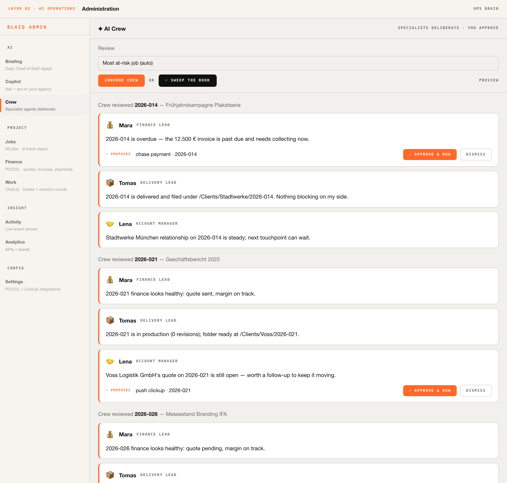
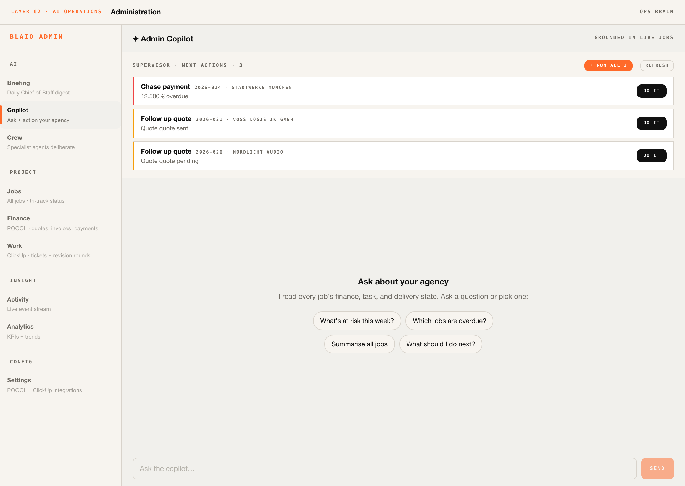
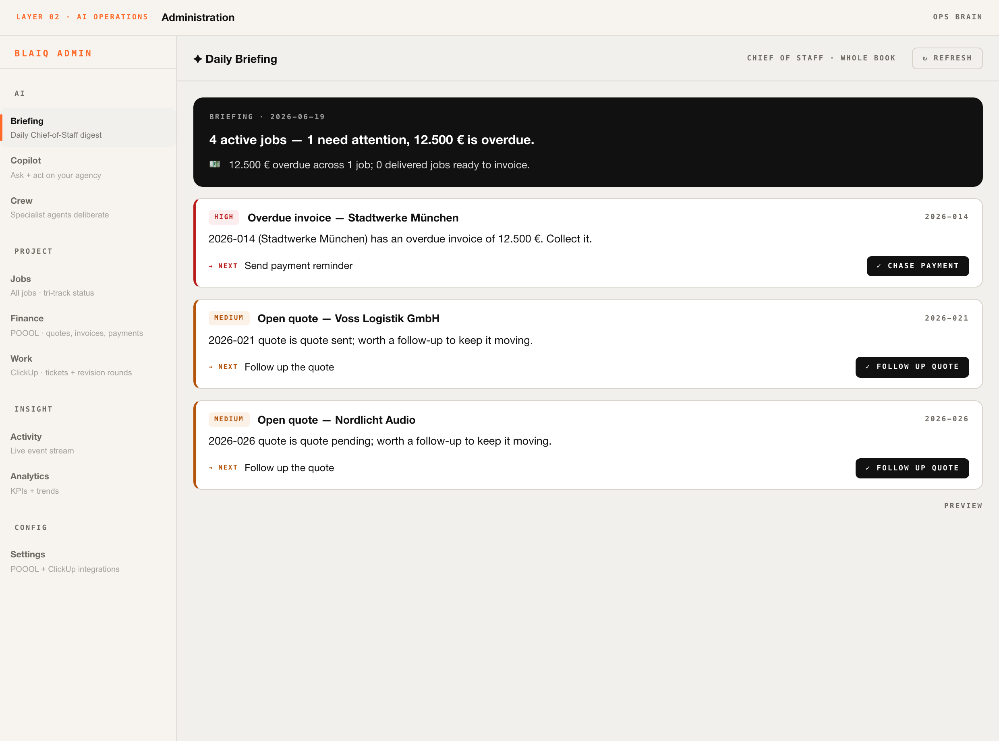
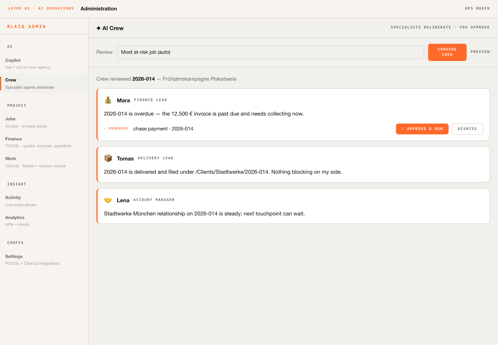
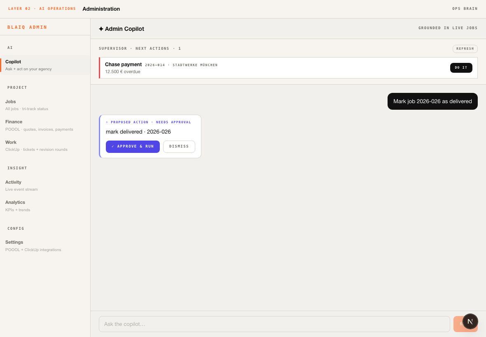
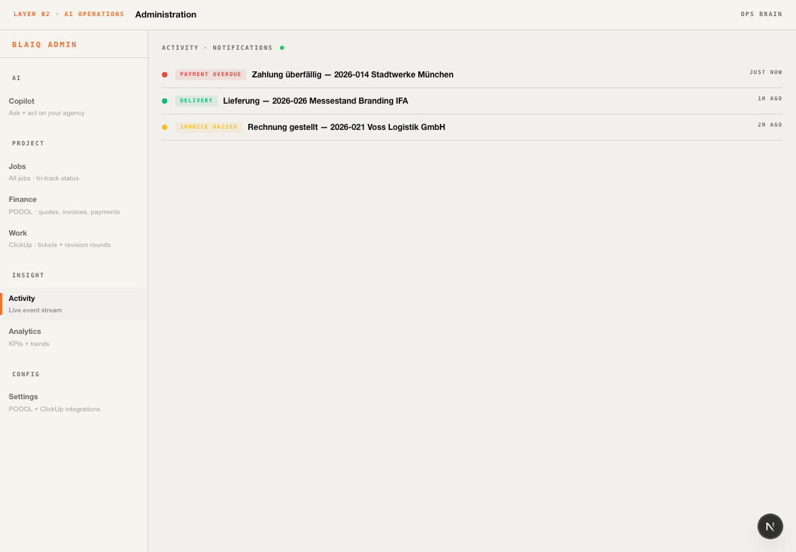
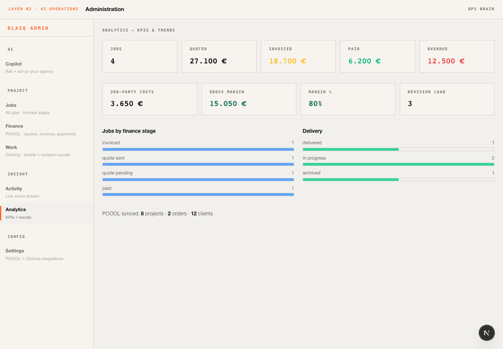
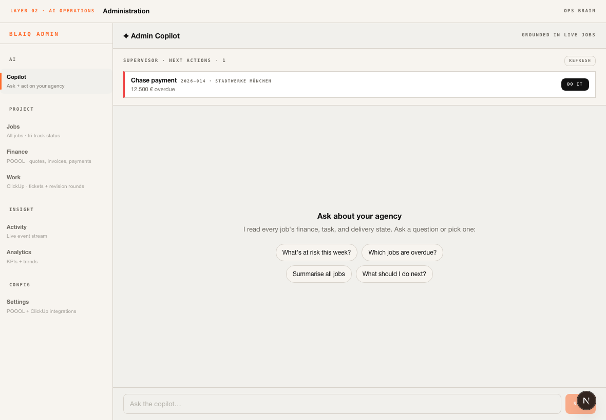
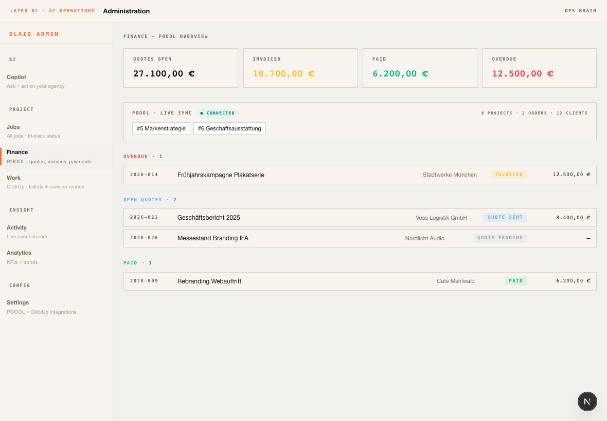

# BLAIQ — The AI Agency Platform

**One platform to run a creative agency on AI: the business side (Administration) and the creative side (GenAI), wired into a single closed loop where agents do the work and a human supervises.**

> Status as of 2026-06-14 — Administration Phase 1 shipped (local), GenAI pipelines live in pieces. This document is the full plan from today's state to a complete, AI-operated agency platform.

---

## 0. The thesis

A creative agency is two machines that today run separately:

1. **Run the business** — intake → quote → plan → track → deliver → invoice → collect.
2. **Do the creative work** — turn a brief into brand-aligned decks, images, videos, copy, prototypes.

B&B (and every agency like it) runs both halves by hand across POOOL, ClickUp, a file server, email, and a pile of creative tools. **BLAIQ's goal is to make AI run both halves and stitch them into one loop**, with the human acting as director and approver rather than operator.

The finished platform looks like this:

```
Client inquiry
   │
   ▼
[ADMIN]  AI opens a Job, drafts the quote (POOOL), sets up tracking (ClickUp + server folder)
   │
   ▼
[GENAI]  On quote approval, AI spins up creative Missions, produces drafts
         (decks / images / video / copy) on-brand via Brand DNA + Hivemind
   │
   ▼
[HUMAN]  Director reviews at HITL gates → requests revisions or approves
   │
   ▼
[ADMIN]  AI delivers to client, issues the invoice, watches payment, chases overdue
   │
   ▼
   Margin, revision load, and throughput flow into Analytics → AI prioritizes the next job
```

Every arrow above is a step BLAIQ automates. The two pillars share one tenant, one brand, one memory, one analytics surface.

---

## 1. Architecture at a glance

```
┌──────────────────────────────────────────────────────────────────────┐
│  apps/web (Next.js 16)  — the single operator surface                  │
│  ┌─────────────────────────────┐   ┌────────────────────────────────┐ │
│  │ LAYER 01 · GenAI / Creative │   │ LAYER 02 · Administration / Ops│ │
│  │ Home·Missions·Brand·Skills  │   │ Jobs·Finance·Work·Activity     │ │
│  │ Artifacts·Memory·Agents     │   │ ·Analytics                     │ │
│  └─────────────────────────────┘   └────────────────────────────────┘ │
└───────────────┬─────────────────────────────────┬──────────────────────┘
                │ /api/*                           │ /api/v1/admin/* (proxy)
                ▼                                  ▼
┌──────────────────────────────┐     ┌──────────────────────────────────┐
│ apps/daemon (Node/Express)   │     │ apps/ops-brain (Python/FastAPI)   │
│ • brand + Hivemind recall    │     │ • Jobs (tri-track) + RLS          │
│ • image/video/text pipelines │     │ • multi-agent orchestrator        │
│ • media providers (19)       │     │ • loop engine + watchdog          │
│ • skills/design-systems/     │     │ • POOOL + ClickUp integrations    │
│   design-templates/craft     │     │ • semantic memory                 │
│ • artifact manifest + store  │     │ • scheduler (cron)                │
└──────────────┬───────────────┘     └────────────────┬─────────────────┘
               │                                       │
               └──────────────┬────────────────────────┘
                              ▼
        Postgres (ops.* tenant-scoped, RLS)  ·  Hivemind (org memory)
        External: POOOL · ClickUp · OpenRouter · Fal · provider APIs
```

**Shared substrate both pillars already use:** tenant identity + HMAC trust, Brand DNA / Brand Tone, Hivemind org memory, the artifact store, and (soon) one analytics layer.

---

## Progress screenshots

**AA5+ — Crew Sweep (whole crew × whole book)** — one click sends all three specialists across the top at-risk jobs at once; each job's crew runs concurrently, so the standup is bounded by the slowest single job, not their sum. Verified live on prod: reviewed 3/4 jobs, surfacing per-job proposals (chase 2026-014, push-clickup 2026-021, mark-delivered 2026-009):



**AA6 — Run the Agency (batch HITL)** — the Supervisor's prioritised next-actions across the whole book, approved in one pass. "⚡ Run all" fires `execute-batch`; each item runs independently (one failure never blocks the rest). The autonomous loop, with the PM's one-click sign-off. Verified live on prod: 3/3 actions ran (invoiced 2026-026, chased 2026-021 + 2026-014):



**AA4 — AI Daily Briefing (Chief of Staff)** — a proactive one-pass digest over the *whole* job book: headline, cash-watch line, and 3–5 severity-ranked insights. **Each insight whose job maps to a rule-based Supervisor action is one-click runnable right from the standup** (the LLM narrates; the rule engine supplies the safe, executable action). The agency's morning standup, and the default landing view. Verified live on prod (`claude-sonnet-4.6`): flagged €20,900 of cash exposure across two overdue jobs, both with a one-click "Chase payment":



**AA5 — AI Crew (multi-agent, HITL)** — instead of one Copilot, a crew of specialist agents (💰 Finance, 📦 Delivery, 🤝 Account) review a job *in parallel*, each from its own remit, and each may propose an action the PM approves. Verified live on prod with the LLM (`claude-sonnet-4.6`): the crew auto-picked the most at-risk job `2026-014`, Finance + Account both proposed *chase payment* on the overdue €12,500 invoice, Delivery cleared it:



**AA2 — Agentic actions (LLM, HITL)** — the Copilot proposes a tool-call from natural language; the PM approves before it runs:



**Activity feed** — live notifications timeline (delivery, overdue, invoice raised) from `ops.notifications`:



**Analytics** — live KPIs (margin, cash exposure, throughput) from jobs + POOOL:



**Admin Copilot + Supervisor** — grounded chat over live jobs, with a rule-based next-actions queue (one-click HITL):



**Finance board — live POOOL sync** (real `ops.poool_cache`: 8 projects · 2 orders · 12 clients):



## Track AA — Agentic Administration (in progress)

The AI layer over Administration (see `TRACK_AA_AGENTIC_ADMIN.md`). Shipped + deployed:
- **AA1 Admin Copilot** — grounded chat over live jobs (`POST /api/copilot`, OpenRouter httpx client). **🟢 Live on prod** with `claude-sonnet-4.6`.
- **AA2 Agentic actions** — the Copilot proposes a tool-call (mark delivered, push POOOL, set finance status, chase payment, …) from natural language; PM approves before it runs (HITL). **🟢 Live on prod.**
- **AA4 AI Daily Briefing** — `GET /api/copilot/briefing`: a Chief-of-Staff pass over the whole job book → headline + cash-watch + severity-ranked insights with job refs and next steps. Insights that map to a Supervisor action are **one-click runnable from the standup**. The default admin landing view. **🟢 Live on prod, verified e2e.**
- **AA5 AI Crew** — `POST /api/copilot/crew`: three specialist agents (Finance, Delivery, Account) deliberate over one job *in parallel*, each proposing an action through the same HITL approval + job-action endpoints. Auto-targets the most at-risk job, or review any job by number. **🟢 Live on prod, verified e2e.**
- **AA5 Crew Sweep** — `POST /api/copilot/crew/sweep`: sends the full crew across the top-N at-risk jobs in one pass (jobs reviewed concurrently). The agency-wide standup. **🟢 Live on prod, verified e2e (3/4 jobs).**
- **AA Supervisor** — rule-based next-actions queue (overdue→chase, delivered→invoice, aging quote→follow-up), one-click HITL `DO IT`. Fully working without an LLM. Verified on prod.
- **AA6 Run the Agency** — `POST /api/copilot/next-actions/execute-batch`: approve the entire prioritised queue in one pass; each item runs independently (one failure never blocks the rest). **🟢 Live on prod, verified e2e (3/3 ran).**
- **One-click Connect** — POOOL + ClickUp connect/disconnect from Settings in a single click.

**🟢 POOOL MCP — LIVE.** ops-brain now reaches the `poool-mcp` container (bridged via the `blaiq-mcp` network, persisted in compose), does the full MCP streamable-HTTP handshake, and syncs real data into `ops.poool_cache` (12 clients, 8 projects, 2 orders). A tolerant parser salvages complete records past the server's 25 KB response cap.

**Known external blockers (need the operator):**
- ~~LLM credits~~ — **resolved.** OpenRouter key funded; Copilot, AA2 agentic actions, and the AA5 crew all answer live on prod with `claude-sonnet-4.6`.
- **ClickUp OAuth** — the interactive authorize→token flow + daemon token-store is the remaining ClickUp build (POOOL read is fully live).
- **Email send channel — built, awaiting SMTP creds.** The notifier now sends real email when `BLAIQ_NOTIFY_*` env is set (compose-wired, all optional); empty by default → stays `logged` (safe). `BLAIQ_NOTIFY_REDIRECT_TO` routes every send to one operator inbox so nothing reaches a real client until removed. Unblocks send-quote / payment-reminder / delivery-notice once the agency SMTP is supplied.
- **POOOL writes are read/create-only by policy** — never delete or destructively mutate real company data; invoice-create is operator-gated, never test-written to the live instance.

**Workflow PDF coverage (tri-track):** Inquiry ❌ (P5) · PM creates job ✅ · POOOL: read/sync ✅ (12 clients·8 projects·2 orders), 15% fee ✅, **quote/invoice WRITE ❌ — `poool_api_create` errors on live POOOL even for a minimal `{name}` project; README claims full CRUD so it's a required-field/payload spec issue, but the API returns no field-level error so the create payload can't be derived empirically. Needs the POOOL create schema.** send-quote 🟡(channel ready), payment check ✅, reminder 🟡(channel ready) · ClickUp 🟡(OAuth) · Server ✅ · Delivery 🟡(channel ready).

**POOOL order states (observed):** `order_state_id=2` = Angebot/quote (number prefix `AB`); both real orders are state 2. No invoiced order exists to observe, and no states model is exposed → the "invoiced" state id is unknown and must be supplied.

## 2. Where we are today

> Status: 2026-06-15 — **A1 + A2 shipped to production** (Hetzner, served via the Cloudflare quick tunnel). Single tenant `BLAIQ` live with seeded sample jobs.

### ✅ Administration — built + DEPLOYED
- **Tri-track Job entity** (`ops.jobs`, RLS) with POOOL / ClickUp / Server tracks.
- **Job CRUD** end-to-end: daemon proxy → ops-brain FastAPI, tenant-scoped.
- **Admin UI**: Jobs board, Finance board, Work (ClickUp) board, Activity feed, Analytics shell, **Settings**.
- **A1 — workflow (deployed, commit `ea20c15`):** itemised third-party costs + 15% fee · payment due + auto-overdue · one-click "Mark as Delivered" · "+1 Revision" on the Work board.
- **A2 — real-data sync (deployed, commit `a9a09aa`):**
  - **Settings tab** editing POOOL (url/key/enable) + ClickUp (enable/list) → `tenant_brand`; keys write-only/masked. Verified e2e on prod (authenticated PUT/GET).
  - **POOOL sync poller** (`poll_poool`) per tenant, every 30 min, no-op until enabled.
  - **ClickUp poller** gated on `clickup_enabled` (fixed a pre-existing `session_scope` import bug that had stopped it loading at all).
  - **Daemon trust bridge** (`verifyOpsTrust`) so the headless ops-brain pollers authenticate to daemon routes via shared-secret HMAC.
  - Migration `011` (ClickUp columns), `aiteam` logging fix, `BLAIQ_DAEMON_URL` wiring.
- **`/admin-preview`** route + in-memory demo store for backendless UI runs.

**🔌 ClickUp MCP integration (in progress):** ClickUp's first-party MCP (`https://mcp.clickup.com/mcp`) is **OAuth-only — no API keys**. Confirmed it supports **Dynamic Client Registration** + OAuth 2.1/PKCE (S256), so BLAIQ can self-register (no manual allowlist). DCR done; the interactive authorize→token flow + a daemon OAuth client/token-store is the remaining build (currently testing the flow manually). This supersedes the Composio path for ClickUp.

### ✅ GenAI — built (in pieces)
- **Brand pipeline**: Brand DNA + Tone editors, Hivemind recall injected into every generation, masked API-key store.
- **Generation pipelines**: image (text/img2img/inpaint), **multi-stage video** (router → script → ref images → TTS → I2V → FFmpeg stitch), text artifacts.
- **19 media providers / 80+ models** (image, video, audio) behind a config + OpenRouter routing layer.
- **Content libraries**: 110+ skills, 140+ design templates (decks/prototypes/business/motion), 130+ design systems (`DESIGN.md`), 12 craft guides.
- **Multi-agent machinery in ops-brain**: orchestrator (TeamManager, GraphCompiler), 25 MCP tool modules, loop engine + watchdog + replay, semantic memory.

### 🔶 The gaps (what this plan closes)
- Admin **read-sync is wired but not yet flowing real data**: POOOL needs a reachable MCP URL + key; ClickUp needs the OAuth flow finished. No write-back, payment automation, or notifications yet (A3–A6).
- No **permanent domain** — prod is on the ephemeral Cloudflare tunnel (changes on restart).
- Production hardening still open: full job CRUD/search, DB backups, monitoring, auth hardening.
- GenAI surfaces **Missions / Workflows / Swarm / Agents / Artifacts are stubs** — the orchestrator exists but isn't driving creative production from the UI.
- **The two pillars are not linked** — a Job doesn't know about its creative Missions, and creative output doesn't flow back into delivery/invoicing.
- No unified **analytics / supervisor** view across ops + creative.

---

## 3. The plan — three tracks to one platform

The roadmap runs as **three parallel tracks** that converge. Administration (Track A) and GenAI (Track B) mature independently; Track C wires them into the autonomous agency. Each phase is shippable on its own.

### Legend
`[done]` shipped · `[next]` immediate · `[ ]` planned · effort = rough size (S/M/L)

---

## TRACK A — Administration (run the business on AI)

> Turns the manual tri-track tool into a self-driving ops desk. Detailed task breakdown lives in the workflow roadmap; summarized here.

| Phase | Goal | Key deliverables | Effort |
|------|------|------------------|--------|
| **A1** `[done ✅ prod]` | Manual workflow complete | Cost line items + 15% fee · payment due + overdue · mark delivered · +1 revision | M |
| **A2** `[done ✅ prod]` | Config + turn on what's written | Settings UI (POOOL/ClickUp) → `tenant_brand`; POOOL sync poller + ClickUp poller live + gated; migration 011; daemon trust bridge | M |
| **A3** `[done ✅ prod]` | POOOL write + payment automation | "Push to POOOL" action (graceful) + **server-side daily payment-overdue auto-flag** (works on local due dates, no POOOL) | L |
| **A4** `[done ✅ prod]` | ClickUp write actions | "Push to ClickUp" ticket (graceful) + auto-ticket per revision round ("Korrektur N", best-effort). Folder auto-create deferred (needs clickup_space_id) | L |
| **A5** `[done ✅ prod]` | Server folder automation | Auto-create per-job delivery folder on the data volume + read-only file listing in the Server panel (real, verified on disk) | M |
| **A6** `[done ✅ prod]` | Notifications | Delivery notice on "Mark Delivered" + overdue reminders; pluggable notifier records to `ops.notifications` (sends once a channel is wired) | M |
| **A2.1** `[next]` | Connect the real external creds | Finish ClickUp OAuth (DCR done) → token store; reachable POOOL URL + key. All A3/A4 write-paths + sync are built & graceful — just need credentials to flow live data. | M |

**Production-usable hardening (single-tenant, parallel to A3+):** `[ ]` permanent domain (off the ephemeral tunnel) · `[ ]` full job CRUD + search/filter/edit/delete · `[ ]` Postgres backups + monitoring · `[ ]` auth hardening. See the top-5 production plan.

**End state of Track A:** a Job created from an inquiry drives POOOL, ClickUp, and the server automatically; invoices issue, payments are watched, reminders send — the PM only approves.

---

## TRACK B — GenAI (do the creative work on AI)

> Promotes the existing generation pipelines + orchestrator from "pieces" to a production studio the UI actually drives.

| Phase | Goal | Key deliverables | Effort |
|------|------|------------------|--------|
| **B1** `[next]` | Mission lifecycle is real | Promote **Missions** from stub to a first-class entity (`ops.missions`: brief, type, brand refs, status, artifact links). Wire MissionBuilder → create Mission → run a pipeline → land artifacts. One persistent home for every creative job. | L |
| **B2** `[ ]` | Artifacts gallery live | Real **Artifacts** browser over the artifact manifest: filter by kind/mission/status, version history, export download, "send to client" handoff. | M |
| **B3** `[ ]` | Brand-locked generation | Every pipeline pulls Brand DNA + Tone + Hivemind by default; per-mission brand override; "on-brand check" pass before an artifact is marked ready. | M |
| **B4** `[ ]` | Agents & Workflows from UI | Surface the ops-brain orchestrator: **Agents** page (templates, capabilities), **Workflows** page (compile a task graph → run), HITL approval gates rendered in the web UI. | L |
| **B5** `[ ]` | Swarm — multi-agent production | **Swarm** view drives TeamManager: a creative brief fans out to specialist agents (creative-director, copywriter, designer, video) running in parallel, reducing to a reviewed deliverable. | L |
| **B6** `[ ]` | Memory as the agency brain | **Memory** browser over Hivemind; every approved deliverable + decision saved as org memory; recall feeds future generations so the agency compounds its taste. | M |

**End state of Track B:** a brief becomes a Mission, agents produce on-brand drafts across decks/image/video/copy, the director reviews in-app, approved artifacts are versioned and ready to deliver.

---

## TRACK C — Convergence (the autonomous agency)

> The payoff: link the two pillars and let AI run the whole loop with the human as director.

| Phase | Goal | Key deliverables | Effort |
|------|------|------------------|--------|
| **C1** `[ ]` | Link Job ↔ Mission | `job_id` on missions / `mission_ids` on jobs. Quote approval auto-creates the Missions for that job; delivering a Mission's artifact advances the Job's Server track. One entity graph across ops + creative. | M |
| **C2** `[ ]` | The Supervisor loop | A long-running ops-brain agent that watches Jobs + Missions and drives them: open tickets, kick off generation, route to HITL, deliver, invoice, chase payment — pausing at approval gates. Built on the existing loop engine + watchdog + scheduler. | L |
| **C3** `[ ]` | Unified Analytics | One analytics surface across both pillars: margin per job (POOOL revenue − costs − **LLM/render spend**), revision load, throughput, agent cost caps. `compute_project_margin()` already exists — wire it in. | M |
| **C4** `[ ]` | Intake automation | Email/Protonet inbound → AI drafts a Job + initial quote from the inquiry, queued for PM approval. Closes the loop at the front door. | M |
| **C5** `[ ]` | Multi-tenant productization | Per-agency onboarding, billing, usage metering, role-based approval policies, audit. Turn BLAIQ from B&B's internal tool into a platform other agencies run on. | L |

**End state of Track C — the finished platform:** an inquiry arrives, AI stands up the job and the creative work, agents produce on-brand deliverables, the director approves, AI delivers and invoices and collects — and every loop teaches the agency's memory. One screen, two pillars, AI doing the work.

---

## 4. Suggested execution order

Feasibility-first, value-first — each step unlocks the next:

0. ~~**A1** — manual workflow~~ · ~~**A2** — Settings + pollers~~ · ~~**A3** — POOOL write + payment automation~~ · ~~**A4** — ClickUp write~~ · ~~**A5** — server folders~~ · ~~**A6** — notifications~~ — ✅ **all done + deployed**. Track A (Administration) is feature-complete; every external integration is built credential-ready and degrades gracefully.
1. **A2.1** — connect real credentials (ClickUp OAuth token store + reachable POOOL endpoint) so the built pipelines flow live data.
2. **B1** — make Missions real (everything in Track B and C1 depends on it).
3. **A3 / A4** — POOOL + ClickUp write actions (the agency stops double-entering data).
4. **C1** — link Job ↔ Mission (the two pillars become one graph).
5. **B2 / B3** — artifacts gallery + brand-locked generation (creative output is deliverable + on-brand).
6. **A5 / A6** — server automation + notifications (delivery + collection close).
7. **C2** — the Supervisor loop (AI starts driving end-to-end).
8. **B4 / B5 / B6** — agents/workflows/swarm/memory from the UI (creative production scales).
9. **C3 / C4** — analytics + intake automation (the business becomes legible + self-feeding).
10. **C5** — productize for other agencies.

---

## 5. Cross-cutting requirements (apply to every phase)

- **Tenant isolation**: every new table RLS-scoped; every cross-service call HMAC-trusted (daemon signs `HMAC(token, tenantId)`).
- **Cost governance**: per-tenant daily LLM/render cost cap already enforced in the admin proxy — extend it to creative pipelines and surface spend in Analytics.
- **HITL by default**: AI proposes, the director disposes. Every irreversible outward action (send to client, issue invoice, push reminder) passes an approval gate until trust is earned.
- **Migrations**: the Alembic chain is unreliable on the live DB — ship schema as idempotent SQL + `alembic stamp` (see `deploy/scripts/`).
- **Secrets**: provider keys live in `media-config.json` / `tenant_brand`, masked on read, never committed.

---

## 6. Glossary

| Term | Meaning |
|------|---------|
| **Tri-track** | A Job's three parallel lifecycles: POOOL (finance), ClickUp (tasks), Server (files). |
| **Mission** | A creative job — the GenAI counterpart of an admin Job. |
| **ops-brain** | The Python/FastAPI sidecar: jobs, multi-agent orchestration, memory, integrations. |
| **Hivemind** | The org-wide semantic memory the agency's taste and decisions accumulate in. |
| **Brand DNA / Tone** | Markdown brand spec injected into every generation so output stays on-brand. |
| **Supervisor** | The Track C autonomous agent that drives Jobs + Missions end-to-end, pausing at HITL gates. |
| **Craft / Design System / Skill / Template** | The creative knowledge stack: universal rules → brand look → capability → output scaffold. |

---

*This is a living plan. Track A detail: see the workflow roadmap. Current deployment state + per-phase deploy steps: `deploy/` and the session memory.*
